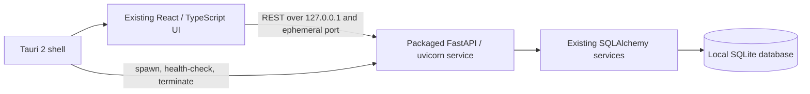

# Architecture

## Product and Module Boundaries

The product is **Music Program Scheduler**. Accompanist Scheduling is its first module. The current import, pianist availability, assignment, and report views remain inside that module; no future module workflows are introduced here.

Academic terms, small people identities, time primitives, locations, and useful file/import infrastructure may be shared when actual reuse is demonstrated. Lesson requirements, pianist availability and workload, accompanist assignment scoring, jury rules, and clinical placement constraints remain module-owned. The accompanist optimizer is not a universal scheduling engine.

## Transitional Desktop Runtime

Tauri currently replaces Electron only as the desktop shell. During development Rust starts `desktop_server.py` with the backend virtualenv (or the configured Python interpreter); production starts the bundled PyInstaller service. Scheduling, imports, reports, and SQLite remain in Python. This is a transitional runtime, not the intended long-term application boundary.

The service binds only to `127.0.0.1`. Tauri reserves an ephemeral port, passes it to the service, waits for `/api/health`, and exposes `http://127.0.0.1:<port>` to React through the narrow `get_api_base` Tauri command. `src/lib/platform.ts` is the only frontend module that detects Tauri or invokes that command. Browser development continues to use `VITE_API_BASE`, then the legacy `apiBase` query parameter, then `http://localhost:8123`.

FastAPI CORS allows only the Vite development origins, the Tauri WebView origins (`tauri://localhost` and `http://tauri.localhost`), and Electron's opaque `null` file origin. Credentials are not enabled; only the API methods and `Content-Type` header used by the app are allowed. CORS does not expose the service beyond its loopback listener.

The service's database path is set to Tauri's per-user application-data directory as `pianist_scheduling.db`. Electron remains available for comparison and continues to use Electron's `userData` path; the two shells therefore have separate local databases and do not concurrently open the same SQLite file. No data is uploaded or synchronized between them.

## SQLite Schema Migrations

The schema version is stored in SQLite's built-in `PRAGMA user_version`; the current supported schema version is **2**. Version 0 is the implicit pre-framework baseline and is classified as either a new empty database or a recognized legacy Accompanist schema. Version 1 is the released Accompanist baseline. Version 2 adds Scheduling Session metadata. A database advertising a higher version is rejected without downgrade or schema changes.

The application-owned ordered `MIGRATIONS` registry and runner live in `webapp/backend/app/database.py`. `init_db()` migrates the active engine; `migrate_database(engine)` accepts any SQLite SQLAlchemy engine so a future Session restore can migrate a staged database before activation. Migration versions start at 1, run sequentially, and are not skipped.

Each upgrade runs under SQLite `BEGIN IMMEDIATE`; schema/data changes and the `user_version` update commit in the same transaction. A failure rolls back and raises `DatabaseMigrationError` with a stable `code` and readable message. Startup does not continue as if migration succeeded. Version 1 creates the original Accompanist schema and absorbs the recognized legacy `lessons.teacher_email` and `lessons.student_id` column additions. Version 2 adds `scheduling_sessions` and one neutral “Legacy Session / Music Program / Term not set” row; it does not infer institution or term from domain data. Current-version opens validate the schema but do not call `create_all`, seed data, or modify domain rows. Unknown tables, malformed known tables, corrupt databases, and newer schema versions fail safely.

To add a schema change, add the next consecutively numbered `SchemaMigration` to `MIGRATIONS` and implement its forward `upgrade(connection)` function. Do not edit a released migration or add startup column checks. There are no down migrations. Migration tests and the synthetic legacy fixture are in `webapp/backend/tests/test_database_migrations.py` and `webapp/backend/tests/fixtures/legacy_accompanist_v0.sql`; run them with `npm test`.

`.mpsession` Open/Restore extracts to a staged database, calls `migrate_database(staged_engine)`, validates it, and only then activates it. The migration runner does not create backups or own replacement UX.

On Unix the service is launched in a dedicated process group, which is terminated on exit so PyInstaller one-file workers cannot survive their parent. On Windows Tauri invokes the fixed system `taskkill.exe /PID <pid> /T /F` operation to terminate the child tree, with direct-child termination as a fallback. Tauri then waits for the child. Startup failure also terminates the child before returning an error. Unix process-group termination was smoke-tested with the packaged service; Windows tree termination still needs a native Windows validation run.

## Platform Abstraction

React's API client depends on `getApiBase()` in `src/lib/platform.ts`. The Tauri adapter obtains the endpoint from a Rust command. Browser builds retain their existing environment/query configuration. No Tauri APIs are called from React pages or components.

The main-window capability grants only dialog open/save and filesystem read/write operations for paths selected by those dialogs. There is no shell, opener, updater, or generic filesystem access exposed to the frontend. Browser builds use a local file input and save picker/download through the same platform service. The custom endpoint command is registered by the Rust application.

## Scheduling Sessions and Portable Archives

One `scheduling_sessions` row describes the active SQLite database: application-generated UUID, institution/program display names, term label, optional year and dates, and created/modified timestamps. There is no `session_id` foreign key across Accompanist tables and no in-app history library. New Session builds an empty current-schema database beside the active file, creates a recovery archive first, then atomically replaces the active database.

Archive format version 1 is a ZIP-compatible `.mpsession` containing only `manifest.json` and `data/session.sqlite3`. The manifest identifies the archive contract, application version, session display metadata, export timestamp, actual database schema version, and payload SHA-256. Archive format and SQLite schema versions are independent: table/schema evolution uses SQLite migrations; archive format changes only when the container or manifest contract changes. Export uses SQLite's online backup API and normalizes the resulting snapshot to a standalone DELETE-journal database, including current WAL state.

Restore rejects malformed, oversized, duplicate, unexpected, encrypted, path-traversing, checksum-mismatched, incompatible, or corrupt input. It stages the fixed database payload in a private temporary directory, checks SQLite integrity and the actual schema version, migrates and validates metadata there, then creates a recovery archive and atomically replaces the active database. Any failure before replacement leaves the active session unchanged.

Automatic recovery archives are valid `.mpsession` files under the active database's `recovery/` directory (Tauri: the per-user application-data directory). Retention is the latest three snapshots. They are distinct from user-exported files and are not shown in a session history UI. Archives are unencrypted and may contain student educational information; users must store and transfer them under institutional policy. The application does not upload session data.

## Privacy and Network

Project and scheduling data remain local. App traffic is React-to-FastAPI HTTP on loopback. There are no telemetry, analytics, cloud, licensing, or remote-service integrations. Tauri does not open a LAN listener. Future location/travel scoring and other module-specific algorithms remain out of scope.
