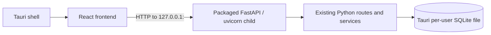

# Electron-to-Tauri Migration

## Status

**Current phase:** Tauri 2 desktop shell around the existing React frontend. Electron remains in the repository for side-by-side validation. No scheduling algorithm, SQLite schema, or Python/FastAPI service has been migrated.

## Transitional Runtime

In development Tauri launches `desktop_server.py` using the backend virtualenv (or the configured Python interpreter); production launches the bundled PyInstaller executable beside the app binary. `externalBin` points to `../../backend/dist/pianist-scheduling-api`, relative to `src-tauri/tauri.conf.json`. Tauri requires the source executable to carry its target-triple suffix, so the build hook creates `pianist-scheduling-api-<target-triple>[.exe]`; Tauri strips that suffix when staging the executable. The hook rejects cross-target builds; Windows x86_64, macOS arm64/x86_64, and other targets must build their Python sidecars natively. Both paths use Rust's `std::process::Command` without a shell or shell plugin. The selected port is reserved on loopback, passed to the service, and checked through `/api/health` before the window is shown. The registered `get_api_base` command provides the endpoint to `src/lib/platform.ts`; browser/Vite builds keep their existing URL configuration.

The service binds to `127.0.0.1` only. FastAPI CORS is restricted to the known Vite, Tauri WebView, and retained Electron file origins. No frontend filesystem or process permissions are granted. No external network connections, telemetry, analytics, cloud storage, or remote services are added.

Closing the main window requests application exit. On Unix the service runs in a dedicated process group and Tauri terminates the full group; on Windows it calls the fixed system `taskkill.exe /PID <pid> /T /F` operation, then waits for the child. The managed process owner repeats cleanup on drop. A startup timeout or failed health check also terminates the child. Unix parent/worker cleanup was tested; Windows cleanup requires native validation.

The Tauri shell uses Tauri's per-user application-data directory for SQLite. Electron retains its previous `userData` location. These databases are intentionally separate while both shells coexist; data migration or sharing requires a later explicit decision.

## Product Naming and Configuration

The Tauri product/window and React document use **Music Program Scheduler**. The working screens remain the existing Accompanist Scheduling workflow; no placeholder clinical or jury modules were added. The provisional bundle identifier is `com.example.musicprogramscheduler` and MUST be finalized before public beta. No production signing credentials or signing configuration are present.

## Deferred Work

- Replace the local FastAPI transport with a local application/service boundary only after equivalent behavior and data compatibility are validated.
- Decide whether and how to migrate/share Electron data before Electron removal.
- Keep the Python solver until a separate migration has regression/equivalence coverage.
- Do not combine accompanist, clinical-placement, and jury optimization into one engine.
- Remove Electron only after later feature-parity confirmation.
