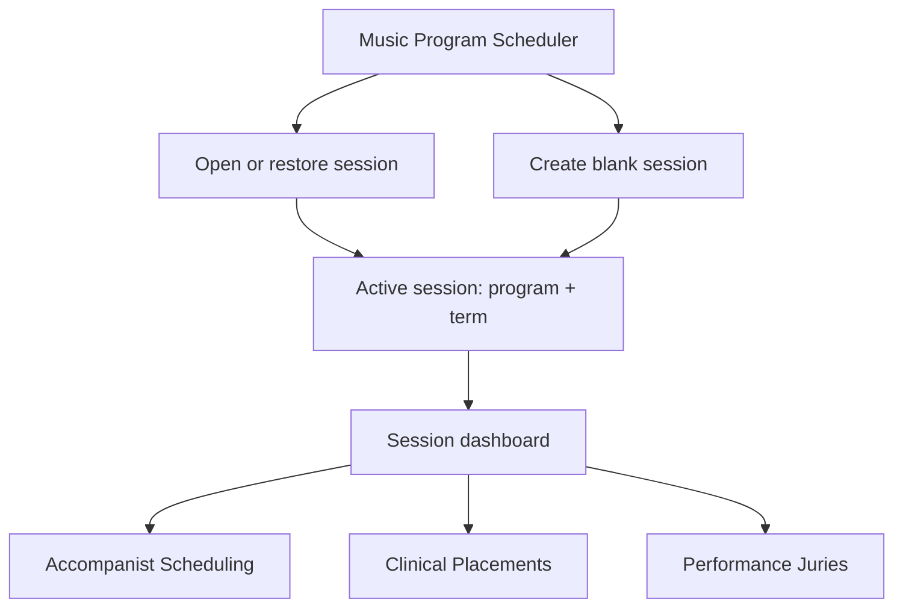

# Music Program Scheduler: Product and Module Architecture

**Status:** Approved product and module architecture. Current runtime, schema, and implementation status are maintained in [ARCHITECTURE.md](ARCHITECTURE.md) and the module-specific design documents.

## 1. Recommendation Summary

Use one local **Scheduling Session** as the unit of work and portability. A session represents one institution/program and one academic term, and contains independent module-owned state for Accompanist Scheduling, Clinical Placements, and Performance Juries. “Project” is a user-facing synonym for a session, not a second domain entity.

Keep the current accompanist workflow intact inside an Accompanist module. Add a product shell around it incrementally: open/create a session, show a session dashboard, then enter the module. Do not expose unimplemented modules as empty placeholder workflows.

Share a small set of proven infrastructure: session open/restore, file parsing and column mapping, availability window normalization, typed validation issues, report rendering/export mechanics, and a versioned finalized-result envelope. Do not share optimizer algorithms, module input schemas, report field definitions, placement/jury schedules, or module-specific validation policy.

The portable `.mpsession` file should be a versioned archive with a manifest and a consistent SQLite snapshot. The embedded database is a private implementation payload, not a permanent public table/schema contract. Open/Restore replaces the active session; any future selective historical import is a distinct workflow.

## 2. Current Implementation

The active desktop/runtime and SQLite schema are documented in [ARCHITECTURE.md](ARCHITECTURE.md). Accompanist behavior is characterized in [ACCOMPANIST-BEHAVIOR-CHARACTERIZATION.md](ACCOMPANIST-BEHAVIOR-CHARACTERIZATION.md). The standalone jury workbook tool remains separate; its behavior is documented in [JURY-SCHEDULER-CHARACTERIZATION.md](JURY-SCHEDULER-CHARACTERIZATION.md).

Performance Juries now has setup/readiness, a pure-domain optimizer, readiness-gated generation, typed result persistence, stale-result detection, and a read-only Schedule UI; see [JURY-OPTIMIZER-CONTRACT.md](JURY-OPTIMIZER-CONTRACT.md). Manual schedule editing and finalization are not implemented.

## 3. Product Shell and Workflow



A session dashboard should summarize its institution/program, academic term, and modules with usable data/results. It links into Accompanist Scheduling and the implemented Performance Juries setup workflow. Clinical Placements remains a shell until its workflow is designed; do not represent it with fake workflow state.

The existing Accompanist UI becomes the first module workflow with minimal movement: its Import, Pianists/Availability, Schedule, and Reports views remain internal Accompanist views. Product navigation owns session selection and the module dashboard; Accompanist navigation and terminology stay inside that module.

**Module lifecycle:** enter an active session; open module inputs; import or edit module-owned data; validate with module rules; run that module's optimizer; permit module-specific manual review/editing; publish a finalized result when another module may consume it; generate reports from the module's declared report catalog. Re-running or changing inputs invalidates only results that depend on those inputs.

## 4. Module Boundaries and Lifecycle Contract

Modules should be statically registered built-ins, not a dynamic plugin loader. A lightweight descriptor may identify a module and provide its navigation entry, input/result schema versions, validation entry point, optimizer operation, report definitions, and declared result dependencies.

A shared host contract can carry lifecycle operations and structured errors, but each module keeps its own concrete inputs, persisted entities, validation policy, optimizer, result payload, UI, and report semantics. The host should not grow large `if module == ...` branches or a single union type containing every future field.

Conceptual registration:

```text
AccompanistModule
  input: lessons + pianist profiles/availability
  validate: accompanist constraints
  optimize: AccompanistOptimizer
  output: AccompanistAssignmentResult
  reports: accompanist-defined reports

ClinicalPlacementModule
  input: student requirements + clinical sites + availability/history
  validate: placement eligibility/capacity/transport constraints
  optimize: ClinicalPlacementOptimizer
  output: ClinicalPlacementResult
  reports: clinical-placement-defined reports

JuryModule
  input: jury roster + faculty/panels + rooms/times + finalized pianist results
  validate: jury-specific constraints
  optimize: JuryOptimizer (or carefully retained Python solver initially)
  output: JuryScheduleResult
  reports: jury-defined reports
```

Each optimizer remains module-specific. A common time-window/conflict primitive is appropriate when semantics match; a clinical student-to-site matching objective is not a time-slot optimizer and must not be coerced into the accompanist algorithm.

## 5. Shared Domain Concepts and Explicit Boundaries

### Reasonable shared concepts

- `SchedulingSession` and `AcademicTerm` metadata.
- Stable basic identity for people who recur across workflows (students, faculty, pianists), without putting module records into a universal person row. The authoritative internal Person id is an application-generated UUID; institutional id and email are optional attributes, not required keys.
- Minimal location/resource identity where multiple modules actually refer to the same place/person.
- Time values, recurring/date-specific windows, import batches, mapping profiles, structured validation issues, file/session operations, report rendering primitives, and finalized-result envelopes.

### Keep module-specific

- Accompanist lesson rows, instruments, pianist requirements, lesson-level Jury Required, workload caps, fit tiers, overlap eligibility, manual locks, schedule consolidation, and assignment scoring.
- Clinical placement requirements, population/service capabilities, capacity, placement history, transport/car access, travel feasibility, equity scoring, and student-to-site allocation.
- Jury areas/panels, jury durations, room sequencing, breaks, jury-day pianist unavailability, jury conflict rules, and jury schedule output.
- Each module's import target fields, validation policy, report catalog, and result payload.

A shared `Person` should contain only identity/display/contact properties and an application-generated UUID. Accompanist-specific pianism/availability belongs to an Accompanist profile; clinical history/transportation belongs to a Clinical profile; repertoire/duration/panel requirements belong to a Jury profile. Institutional identifiers are optional and may be scoped by institution. Never merge records automatically based only on matching display names. A single `Assignment`, `Schedule`, or universal optimizer is explicitly rejected.

## 6. Shared AvailabilityWindow Concept

Availability is now demonstrated across modules, so provide a shared normalized value type and infrastructure, but do not force one editor or one optimizer policy.

Conceptual value shape:

```text
AvailabilityWindow
  start/end: local time range (half-open [start, end))
  occurrence: recurring weekday OR dated interval
  status: Available | Tentative | Unavailable
  source: manual | import
  import provenance: optional batch/row reference
```

The model must permit multiple windows on one day and must not assume 30-minute granularity. No session timezone is required now; add timezone semantics only when a demonstrated date-specific workflow needs them. Submission completeness is separate from status: absent windows are unknown for an incomplete horizon and derive Unavailable for a valid complete horizon. Do not add “Not supplied” to the shared status vocabulary.

Share parsing, canonicalization, interval validation, status vocabulary, provenance, and test utilities. Same-status overlapping windows may be normalized/merged. Conflicting-status overlaps must produce a validation/review issue and must not be silently merged. Keep status interpretation, recurrence/exception rules, owner, scoring, and validation policy module-specific. Tentative may be a soft preference for accompanist assignment but treated as unavailable by the existing jury input; the common type must not erase that difference.

For persistence, prefer a shared `AvailabilitySet`/`AvailabilityWindow` representation with typed owner relationships rather than an unvalidated polymorphic `owner_type + owner_id` foreign key. People can be shared identities; rooms/resources can use a separate minimal shared identity. If typed links add too much complexity before a second implementation exists, first share the value type/import contract and keep module-owned tables; promote to shared storage only with evidence.

Do not replace Accompanist's grid or round all windows to 30-minute slots. Its current editor can initially adapt slots to/from canonical windows while retaining the same displayed interaction and solver inputs.

## 7. Availability Import and Editing Workflow

Use a shared import pipeline, not a universal spreadsheet schema:

1. A module chooses an availability import action and supplies its own required/optional field map and target owner context.
2. The shared file service accepts local CSV/XLS/XLSX files, including spreadsheets exported from Microsoft Forms. There is no Forms API or network dependency.
3. A common parser returns source columns/rows; a module-owned mapping profile maps columns such as person/student/resource, day/date, start, end, and status.
4. Preview normalized windows, duplicates, invalid times, unknown statuses, and conflicts before commit. Keep row-level warnings and import provenance.
5. Commit valid windows transactionally to the selected module's availability set. The imported rows become ordinary editable application records.
6. Existing manual editing remains available. A user edit changes the normal window record and retains its origin/import provenance; it is not a separate temporary overlay.

Profiles should be keyed by module/data kind and user/program context, not shared blindly between lesson and availability spreadsheets. Re-import replacement semantics must be explicit and limited to the selected module; they must never replace the full Scheduling Session. The preferred Accompanist workflow is: import Lessons, import Pianist Availability, review/edit Pianists and Availability Windows, then run Best-Fit Assignment. A Pianist Availability import is a full-roster replacement: rows are grouped only by Pianist Name after trimming surrounding whitespace and collapsing repeated spaces within that file. It never matches an imported name to the previous roster or reconciles by email or identifier. Preview the incoming names and Availability Windows, then warn and confirm before atomically replacing the Pianist roster and Accompanist weekly availability, clearing Lesson assignments, and deleting all Jury Availability Windows for every date. Student Lessons, Jury Required values, Panels, Panel dates, and Panel choices remain. Each imported name receives a fresh internal identity. Email is blank unless explicitly mapped; Max Hours Per Week starts at 40. Application-generated record identifiers remain internal and are never requested or displayed. A valid wide Forms row with all mapped windows blank is a complete zero-availability response, while malformed rows or incomplete mappings block the entire import. The current Accompanist lesson importer is a reference for preview/mapping, not a schema to generalize.

Each module may compose shared primitives differently: a weekly grid for accompanist availability, a student/site form or calendar for placements, and date-specific faculty/resource windows for juries. No Forms API, cloud sync, or external import service is proposed.

## 8. Session, Institution/Program, and Academic Term

Use one entity: **Scheduling Session**. “Project” may appear as a user-facing synonym but is not a separate persisted entity. One session represents exactly one institution/program and one academic term. One active session/database at a time is the initial architecture; do not build an in-app historical session library.

A session metadata record has exactly:

- internal UUID;
- institution display name;
- program display name;
- term display label;
- optional year, start date, and end date;
- created and modified timestamps.

Module-owned data and results belong to that session. Do not require a timezone. Exact term dates are optional and not required for v1.

Model Academic Term as a real organizing concept, but do not assume terms are only Fall/Spring/Summer. Keep the display label and optional bounds so quarter systems, summer sessions, and custom terms work. Do not infer terms from existing lesson dates or filenames.

**Simplest relationship:** institution and program are display metadata on a Scheduling Session; the term label/year/dates are term metadata on that same session. Do not build institution account hierarchies, departments, multi-tenant organization trees, a reusable institutional directory, or a separate Project entity. The existing `Organization` row is an MVP persistence placeholder, not proof of multi-tenant product requirements.

The existing database contains one active working set. Migration should preserve it as a “legacy session / term not set” and let the user label it; do not silently assign a semester. Starting a new blank session replaces the active session after user confirmation. No historical session library is part of the initial architecture.

## 9. Portable `.mpsession` File

Adopt `.mpsession` as the portable extension. Use a ZIP-compatible archive with a versioned manifest and a consistent database snapshot:

```text
Carroll-Fall-2027.mpsession
  manifest.json
  data/session.sqlite3
  checksums.json          (optional if hashes live in the manifest)
```

The public file contract is the archive format and manifest, not SQLite table names or ORM details. The database payload is an internal transport snapshot that allows a complete local session to move between installations without cloud services. Future implementations may change the payload while retaining the `.mpsession` contract. V1 does not require encryption or password protection; exported files may contain student educational information and must be stored/shared appropriately.

Manifest fields should include:

```json
{
  "format": "music-program-scheduler-session",
  "formatVersion": 1,
  "sessionId": "uuid",
  "institution": "Carroll University",
  "program": "Music",
  "term": {
    "label": "Fall 2027",
    "year": 2027,
    "startDate": null,
    "endDate": null
  },
  "applicationVersion": "...",
  "databaseSchemaVersion": "...",
  "modules": {
    "accompanists": { "schemaVersion": 1 },
    "clinical-placements": { "schemaVersion": 1 },
    "juries": { "schemaVersion": 1 }
  },
  "payload": { "path": "data/session.sqlite3", "sha256": "..." }
}
```

The example is conceptual; only modules actually represented in the archive need entries. A session with no Jury data must not require a Jury module implementation.

Export should use SQLite's online backup/snapshot mechanism or a quiesced, checkpointed database, not copy the main `.db` while WAL writes may be pending. Write the archive to a temporary file, flush/close, verify the manifest/checksum, then atomically publish the final file. The filename can be suggested from institution/program/term, but identity must come from the manifest, not the filename.

### Open/Restore versus historical import

**Open/Restore Session** validates and replaces the current active session. Before replacement, the application automatically creates a local recovery snapshot and asks the user to confirm. Then it stages extraction to a private temporary directory, rejects path traversal/unknown required payloads/oversized archives, verifies checksums and SQLite integrity, migrates the staged payload, and atomically switches/replaces the active store. If any step fails, keep the previous active session untouched and return a structured error. The recovery snapshot is local and is not a historical session library.

A later **Import Data From Previous Session** is a separate feature with module-specific selection and reconciliation rules (for example importing clinical history into a new term). It is not part of Open/Restore and is not required now.

## 10. Versioning and Session Migration

Keep distinct versions for:

- archive `formatVersion` (manifest/container contract);
- application/session schema revision (internal persistence migration level);
- each module's serialized state/result contract version.

On open, validate format ID/version first. Reject unknown future major formats clearly; allow documented older formats through sequential migrations. Migrations operate on a staged copy, are deterministic and tested with anonymized fixture archives, and never mutate the source archive. Record the source and resulting schema versions in migration logs without logging student data.

Use a proper versioned SQLite migration mechanism (Alembic or an equally explicit migration registry) instead of extending `create_all` plus one-off `ALTER TABLE` checks. Maintain import compatibility for the current unversioned SQLite DB and create a backup before upgrading. Database migration and archive format migration are related but separate code paths.

## 11. Reporting Architecture

Share report infrastructure as a safe, module-declared projection system. Do not let users enter SQL, ORM expressions, or arbitrary column paths.

Each module registers `ReportDefinition`s with:

- report id/title and module ownership;
- a list of allowed typed fields (id, label, type, accessor/projection);
- supported filter operators per field;
- sort/group capabilities;
- default columns/order and title options;
- a module-owned row provider that applies its own joins and privacy/validation rules.

A shared `ReportRequest` contains selected field IDs, validated filters, sort/group definitions, and title. A shared renderer handles preview/table formatting, stable sorting/grouping, and output adapters. Field meaning and availability remain controlled by the module. A saved `ReportView` can be scoped to a module and session and versioned against its definition; invalid saved field IDs should be reported and allow repair, not silently query arbitrary data.

Output adapters can share an XLSX writer (the local Python backend already uses `openpyxl`), CSV where useful, and print/PDF-oriented HTML. The current Accompanist Markdown and PDF report remains the behavioral baseline; first wrap or adapt it rather than replacing its semantics. Clinical and Jury later supply their own fields and reports. Report files remain generated locally.

## 12. Cross-Module Results

Modules communicate through a session-level result registry, not direct solver/database imports and not spreadsheet round trips. A shared envelope should carry identity/provenance while the payload remains typed/module-specific:

```text
ModuleResultEnvelope
  session_id
  module_id
  result_id
  result_contract_id + version
  state: draft | finalized | superseded
  created_at / finalized_at
  input_revision or source-result references
  opaque module-owned payload
```

Accompanist publishes a finalized `AccompanistAssignmentResult`; Jury declares a dependency on that contract and resolves student/pianist associations through stable shared IDs. The Jury module should not import `AccompanistOptimizer` or query its tables directly. Internally represent draft/finalized/superseded states while keeping user-facing labels simple. If a finalized result consumed by another module changes, mark the dependent result as potentially stale and surface that condition to the user before it is reused.

The legacy name join is historical behavior only. The integrated boundary uses session-scoped shared Person UUIDs and stable Lesson UUIDs. Schema v4 groups identical trimmed nonblank Student IDs, keeps blank-ID lessons distinct, and flags conflicting normalized names for review. Schema v7 stores Jury Required as Accompanist-owned source lesson data, default false for existing lessons. Finalized `accompanist.assignment-result` contract v2 publishes one typed entry per source lesson including Jury Required. Jury edits that same source field by stable Lesson UUID through the Accompanist-owned service; no Jury-owned Boolean copy exists. Jury also owns Panel assignment (auto-filled on exact case-insensitive Instrument/Panel Name match when the Lesson Roster opens, otherwise user-selected), each Panel's date, and date-specific availability. Readiness blocks stale source results; generated Jury snapshots preserve dependency provenance and expose stale status without relinking history. `.mpsession` remains format version 1.

## 13. Relationship to Current SQLite and Tauri

The application currently uses the Tauri → React → local FastAPI/SQLAlchemy → SQLite runtime on loopback. Schema version 9 contains shared identities, the finalized-result registry, Accompanist-owned Jury Required facts, and Jury-owned inputs. The `.mpsession` archive remains format version 1. Runtime, migration, and staged restore mechanics are maintained in [ARCHITECTURE.md](ARCHITECTURE.md); do not duplicate those implementation details here.

## 14. Future Browser Compatibility

Keep product and module contracts independent of Tauri and HTTP. A browser version must support local import/export, local session storage, and local scheduling without uploading student data. The current Python sidecar does not run unchanged in an ordinary browser; define a local execution strategy before claiming browser parity. Do not introduce WebAssembly or cloud storage prematurely.

## 15. Ongoing Module Work

The Accompanist and Jury boundaries are implemented and documented in [MODULE-ARCHITECTURE.md](MODULE-ARCHITECTURE.md), [ACCOMPANIST-BEHAVIOR-CHARACTERIZATION.md](ACCOMPANIST-BEHAVIOR-CHARACTERIZATION.md), and [JURY-OPTIMIZER-CONTRACT.md](JURY-OPTIMIZER-CONTRACT.md). Clinical data-entry requirements must come from the Music Therapy workflow owner; do not design its optimizer before those policies are known.

## 16. Canonical References

- Current runtime, schema, platform permissions, and session archive behavior: [ARCHITECTURE.md](ARCHITECTURE.md).
- Module ownership and cross-module boundaries: [MODULE-ARCHITECTURE.md](MODULE-ARCHITECTURE.md).
- Jury data, optimizer, generation, and result lifecycle: [JURY-MODULE-DATA-DESIGN.md](JURY-MODULE-DATA-DESIGN.md) and [JURY-OPTIMIZER-CONTRACT.md](JURY-OPTIMIZER-CONTRACT.md).
- Build and test commands: [BUILDING.md](BUILDING.md).
- Privacy requirements: [PRIVACY-ARCHITECTURE.md](PRIVACY-ARCHITECTURE.md).
