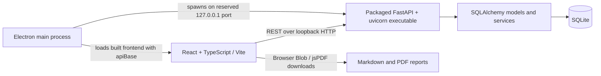

# Phase 1: Architecture Assessment and Proposed Migration Plan

**Status:** Assessment only. No application code has been changed.

## Executive Assessment

The repository contains two related but separate deliverables:

1. A set of Python command-line tools for accompanist assignment, jury-day scheduling, lesson reports, and room schedules.
2. An Electron desktop application for accompanist scheduling, implemented as a React/TypeScript frontend, a packaged Python/FastAPI/uvicorn local API, and SQLite persistence.

There is no Tauri project, Rust code, product-level module architecture, academic-term model, or automated application test suite in the current tree. The desktop app is currently a single accompanist workflow. Its internal tabs are appropriate views for that workflow, but its product name, header, data model, and API are all accompanist-specific.

The safest migration is incremental: establish behavior-preservation tests first, isolate frontend platform access and module-specific business logic, then replace Electron/HTTP infrastructure in stages. Keep both scheduling algorithms separate. Preserve the existing Python implementations until equivalence can be demonstrated, and do not implement clinical-placement or jury application modules as part of the desktop migration.

## Current Architecture

### Desktop runtime



- Electron's main process reserves a loopback port, starts the packaged API executable, waits for `/api/health`, and passes the selected API URL to the React page as a query parameter. On quit it kills the API process.
- The renderer has context isolation enabled and Node integration disabled. There is no preload or Electron IPC surface; frontend data operations use `fetch` through `src/lib/api.ts`.
- The API executable is built with PyInstaller from `backend/desktop_server.py`. Electron Builder includes that executable as an extra resource. Python is a build-time dependency, not an end-user installation prerequisite for the packaged desktop build.
- The API binds to `127.0.0.1`, while FastAPI currently enables wildcard CORS. This is broader than the local desktop use case needs and should be reviewed when the transport is changed.
- SQLite is placed in Electron's per-user `userData` directory in the packaged app. A direct API development run instead defaults to a database file under `backend/`; this behavior is selected by `PIANIST_SCHEDULING_DB_PATH`.

### Frontend and API responsibilities

The frontend is a Vite single-page React application with four accompanist workflow views: lesson import, pianist availability, assignments, and reports. The API wrapper directly encodes REST paths and a configurable HTTP base URL. The current UI has no product dashboard or term selector.

FastAPI routes cover pianist CRUD, pianist availability, lesson CRUD, CSV/XLSX import preview and commit, assignment generation/validation/clearing, and Markdown report generation. Recoverable route errors are generally returned as HTTP errors. SQLAlchemy models and Pydantic schemas are in the same backend package as the API transport.

### Data and behavior flow

```mermaid
sequenceDiagram
    participant User
    participant UI as React UI
    participant API as FastAPI
    participant DB as SQLite
    participant Solver as Accompanist service
    User->>UI: Select CSV/XLSX
    UI->>API: Upload file for preview
    API->>API: Parse with pandas; cache frame by upload token in memory
    API-->>UI: Columns, first 20 rows, token
    User->>UI: Map fields and confirm import
    UI->>API: Commit mapping and token
    API->>DB: Delete prior lessons; insert mapped lessons and optional profile
    User->>UI: Run assignment or edit a pianist assignment
    UI->>API: Run / patch / validate
    API->>Solver: Build in-memory engine objects and assign/recompute
    Solver-->>API: Assignments, derived hours, conflicts
    API->>DB: Persist assignment state
    API-->>UI: Typed response data
```

- Import accepts CSV/XLS/XLSX through the API, displays a preview and column mapping, and can save a mapping profile. A successful commit replaces all stored lessons; it does not merge them. Staged uploads live only in a process-local dictionary between preview and commit.
- Lesson edits and pianist assignment edits are persisted through PATCH requests. An explicit pianist change/clear sets `manually_edited`; subsequent optimizer runs lock those lessons and seed them into conflict/workload calculations. A normal edit to lesson fields does not itself set the manual-assignment lock.
- Assignment validation recomputes marginal pianist hours and double-booking/over-cap notes without rerunning the optimizer.
- The desktop app exports Markdown from current assignments through the API and renders/downloads it as Markdown or PDF in the browser. It does not currently export the CLI's Excel assignment workbook or jury schedule.
- The standalone CLI continues to read/write Excel workbooks. The jury script reads the pianist assignment workbook and joins assignments to students by student name; it does not consume structured output from the desktop app.

### Scheduling and scripts

- `backend/app/services/scheduling.py` is a Python in-memory accompanist assignment engine adapted from `generate_pianist_schedule.py`. It accepts lightweight engine records and computes fit tiers, availability, conflicts, workload caps, schedule penalties, and derived hours; the router translates between ORM and engine records.
- `generate_pianist_schedule.py` remains a separate Excel-oriented implementation. Its published behavior includes required-pianist matching, fit tiers, overlap handling, conflict fallback, workload balancing, cap repair, block/travel-aware tie-breaking, and multi-sheet Excel output. The README describes this CLI behavior as established functionality.
- `generate_jury_schedule.py` is a separate jury-day solver. It schedules fixed-length jury slots by area and room, respects fixed pianist commitments/unavailability, inserts breaks, reduces gaps, and writes summary, area, and pianist sheets. It is not an endpoint in the desktop API.
- `generate_lesson_markdown.py` creates reports from a separate master-workbook schema. `generate_lesson_schedule.py` creates a room-oriented Excel schedule. `generate_test_data.py` produces synthetic Excel inputs, but is not an automated test suite.

### Persistence and packaging

- The SQLite schema currently contains `Organization`, `Pianist`, `AvailabilitySlot`, `Lesson`, and `ImportProfile`. There is no project, academic term, person, student, faculty, location, module-result, or schema-version model.
- Most data is attached to a default organization, but API queries are not organization-scoped and the organization is not selected by a user. This is an MVP placeholder, not working multi-tenant isolation; it should not be treated as a product architecture requirement.
- Schema setup uses `create_all` plus two hand-written column additions. There is no general migration/versioning mechanism.
- The root README documents the Python command-line utilities; `webapp/README.md` documents the separate desktop app. Product naming and setup documentation are consequently split across two views of the repository.
- The desktop installer is currently built separately on target operating systems. Electron Builder packages the frontend and a PyInstaller one-file API executable for Linux, macOS, and Windows targets.

## Domain Boundary Assessment

The governing rule is to share only concepts demonstrated across modules, and to share small identities/primitives rather than universal scheduling records.

| Concept | Assessment | Boundary recommendation |
|---|---|---|
| Academic term | Genuinely product-wide: accompanist, clinical-placement, and jury work normally belong to a term. Not represented in the current app. | Add as a product-level organizer when project/term workflows are designed; do not retrofit speculative term fields into every record during the shell migration. Define how existing unscoped local data maps to a term. |
| Student identity | Genuinely shared: students occur in lessons, clinical placements, and juries. Current code stores student name and an optional external ID on each lesson. | Share only stable identity and basic display/contact data if needed. Keep lesson/instrument/pianist requirements, placement history/transportation, and jury duration/panel requirements in module-owned records. Plan for legacy rows with no stable ID and avoid name-only cross-module joins. |
| Faculty/instructor identity | Likely shared identity: instructors teach lessons and faculty may serve on juries. The current app stores teacher name/email inline. | A minimal identity/contact reference may be shared when multiple workflows need it. Teaching assignments, jury panel roles, availability, and module-specific constraints remain separate. Do not create a broad universal Faculty object prematurely. |
| Pianist/accompanist | A person identity may be shared with jury workflows, but the role and its scheduling attributes are accompanist-specific. Jury scheduling consumes the finalized pianist/student pairing. | Keep pianist qualification, accompanist availability, weekly-hour cap, lesson assignment, fit score, and manual lock in the accompanist module. Expose finalized assignments through a narrow structured result contract for jury use, not through direct solver coupling or a workbook round trip. |
| Time, date, time range, day | Reusable primitives across lessons, placements, and juries. | Shared value types/utilities are reasonable. Do not assume every module has the same time granularity, timezone needs, recurring pattern, or slot semantics. |
| Availability | A recurring availability concept appears in accompanist and jury inputs, and future placements have student/site availability. The current 30-minute pianist grid is not universal. | Share only a minimal representation/helper if actual reuse is demonstrated. Keep the owner, recurrence, status meaning, exceptions, and evaluation rules module-specific. |
| Location, room, site | Locations recur across lesson rooms, jury rooms, and clinical sites, but those are not interchangeable operationally. | A small location identity or address primitive may be shared. Keep site capacity, population/service capabilities, room scheduling, travel feasibility, and placement requirements in their modules. |
| Assignment / schedule | All modules produce decisions or schedules, but their shapes differ: pianist-to-lesson, student-to-clinical-site, student-to-jury-slot. | Do not create one universal assignment/schedule schema or optimizer. A lightweight finalized-result envelope may identify module, term, version, and payload without flattening module data. |
| Imports, exports, validation | Shared infrastructure opportunity, not a shared universal input schema. | Reuse file selection, parsing helpers, error reporting, and export mechanisms where appropriate. Preserve each module's own mapping, validation rules, and output format. |
| Lesson, instrument, required pianist, fit tier, workload cap, schedule block, jury area, slot duration, breaks | These encode current accompanist or jury workflows, not universal music-program concepts. | Keep inside their owning module. `Area` and jury scheduling rules belong to jury; lesson and accompanist fit/workload concepts belong to accompanist. |

A product-level `Person`, `Student`, `Assignment`, or `Availability` object should not become a container for every future module's fields. The current `Lesson` row is an accompanist input plus its result state, not a reusable product-wide schedule entity.

## Findings and Migration Risks

1. **Behavior has no automated regression gate.** The backend test directory contains only its package initializer; the frontend has no test script or test framework. A solver or transport rewrite would currently have no automated equivalence check.
2. **There are two implementations of accompanist assignment.** The CLI and webapp service are related but separate adaptations. Treat behavior as something to characterize and compare, not assume they are identical.
3. **Jury interoperability is lossy and fragile.** The Python jury script joins assignment results by student display name from Excel. Duplicate names and name changes can associate the wrong pianist; current app storage has an optional student ID but the CLI workbook handoff does not establish a stable cross-module key.
4. **Persistence is local but not project/term organized.** The desktop database path differs by packaged versus development mode, and the current schema lacks project/term metadata and formal migrations. Preserve existing local data and define an explicit upgrade/import path before changing storage.
5. **The platform boundary is transport-shaped.** React directly calls REST endpoints and selects its API base from URL/environment configuration. Tauri should not be introduced by distributing native calls throughout pages; introduce an application-facing typed service boundary first.
6. **The current API process is local but still a server.** It uses a dynamically reserved localhost port, HTTP, broad CORS, and a separately packaged runtime. A Tauri migration can remove this transport, but solver behavior should not be entangled with that change.
7. **The organization schema is not tenant isolation.** There is no authentication or request scoping. Do not let this placeholder drive a cloud/server architecture or expose student scheduling data remotely.
8. **Documentation does not yet describe the full product consistently.** The root README focuses on CLI scripts, while the webapp README describes the packaged accompanist app. Architecture/privacy/distribution documents referenced by the migration instructions are not present in the repository.

## Proposed Migration Plan

The following steps are proposed after Phase 1. They are deliberately gated so solver correctness and existing data are not traded for architectural tidiness.

### Phase 2: Characterize and protect current behavior

- Inventory and document API contracts, workbook schemas, existing persisted data, CLI outputs, and build/release expectations.
- Create synthetic, deterministic tests for the webapp accompanist engine and golden/regression cases for the CLI behavior. Cover required pianist matching, availability tiers, overlaps, conflicts, caps, union-hours, manual locks, import parsing/mapping, report output, and edge cases.
- Establish comparison fixtures for the CLI and webapp where their intended behavior overlaps; explicitly record intentional differences before changing either implementation.
- Record baseline installer and development workflows on supported operating systems. Do not change the optimizer in this phase.

### Phase 3: Establish module and platform boundaries without changing behavior

- Keep the current UI and introduce a typed application service interface for lessons, pianists, availability, assignment operations, imports, persistence, and reports. Keep the existing REST client as the initial adapter.
- Move domain/solver operations behind module-owned interfaces; keep the accompanist solver independent of React, HTTP, SQLite, Electron, and Tauri.
- Treat the current screens as views within an Accompanist module. Introduce only the minimum product shell/module navigation needed to make the product identity general; do not implement clinical or jury workflows.
- Define an academic-term/project migration decision and backward-compatible mapping for existing local data before making terms mandatory.

### Phase 4: Add the Tauri 2 desktop shell

- Add Tauri 2/Rust scaffolding and reproduce the current application startup, window, dev-server, and production asset behavior while retaining the React frontend.
- Implement narrow platform adapters for app-data paths, local project storage, file open/save dialogs, and settings. Use least-privilege capabilities and typed commands; do not expose generic shell execution.
- Preserve the existing local SQLite data and provide a versioned schema migration path. Keep data local and usable offline.
- Initially retain the Python solver as a bundled sidecar if required for behavior preservation; package it for end users so no Python installation is needed. Avoid a persistent localhost service when a narrow process interface can provide the same local capability.

### Phase 5: Replace local HTTP incrementally

- Add a Tauri adapter behind the service interface and move CRUD/import/export operations off loopback HTTP in small slices.
- Keep domain services and solvers outside Tauri command handlers; handlers validate inputs, call application/module services, and return structured errors/results.
- Keep a browser-compatible adapter for local development and future web reuse. Desktop-vs-web and local-vs-cloud remain separate decisions.
- Remove Electron, its process lifecycle, the API base URL, CORS, and local HTTP only after feature parity, persistence compatibility, and packaging checks pass.

### Phase 6: Migrate solver/runtime components only with evidence

- Prefer preserving the proven Python accompanist engine until the Phase 2 equivalence suite is reliable. Migrate individual behavior only when the Rust implementation passes those tests.
- Keep jury scheduling as its own future module/solver migration. Do not force it into the accompanist algorithm or build the module during this desktop migration.
- Replace the jury spreadsheet handoff with a structured, finalized accompanist-result contract when the jury module is implemented. Use stable identities where available and define a safe legacy reconciliation path.
- Remove the bundled Python runtime only when all required functionality has a verified replacement. A bundled sidecar is an acceptable intermediate state; end users must not need Python.

### Phase 7: Distribution, security, and release validation

- Validate development builds without signing credentials and native packaging on Linux, Windows, and macOS, including Apple Silicon and Intel macOS where practical.
- Verify offline scheduling, local-only student data, database upgrades, import/export compatibility, manual adjustments, installer update/uninstall behavior, and recovery from process/file errors.
- Audit Tauri permissions, command input validation, filesystem scope, network access, and logs for personally identifiable data. Add no telemetry, analytics, advertising, cloud storage, or student-data network transfer.
- Update product, architecture, privacy, building, and distribution documentation to reflect implemented behavior rather than aspirational architecture.

## Phase 1 Exit Criteria

- [x] Read the repository instructions and migration plan in full.
- [x] Inspect current desktop, frontend, backend, Python CLI, data, and packaging paths.
- [x] Identify shared music-program concepts separately from accompanist- and jury-specific concepts.
- [x] Produce the architecture assessment and proposed follow-on plan.
- [x] Make no application-code changes.

**Phase 1 deliverable:** this assessment. The next actionable gate is Phase 2's behavior characterization and regression tests, before any solver or persistence rewrite.
